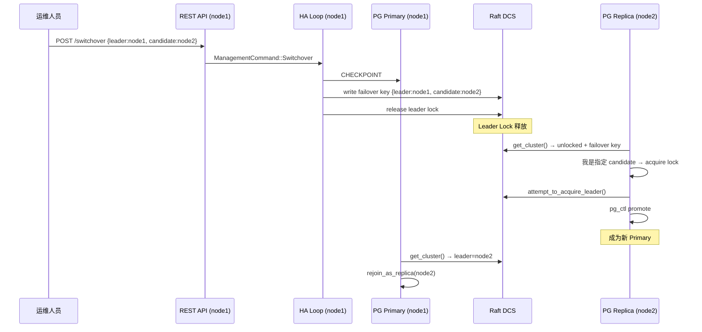
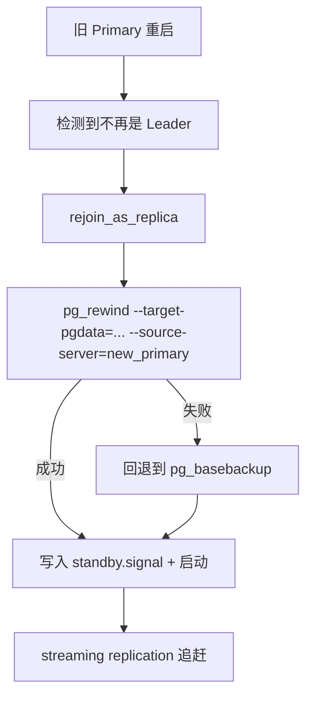

# pg-ha 运维指南

## 集群状态检查

### 集群总览

```bash
# 查看集群所有成员及拓扑
curl -s http://localhost:8008/cluster | jq .
```

响应示例：

```json
{
  "scope": "prod-cluster",
  "members": [
    {
      "name": "node1",
      "role": "Primary",
      "state": "Running",
      "conn_url": "host=node1 port=5432",
      "api_url": "http://node1:8008",
      "timeline": 1,
      "lag": 0
    },
    {
      "name": "node2",
      "role": "Replica",
      "state": "Running",
      "conn_url": "host=node2 port=5432",
      "api_url": "http://node2:8008",
      "timeline": 1,
      "lag": 128
    },
    {
      "name": "node3",
      "role": "Replica",
      "state": "Running",
      "conn_url": "host=node3 port=5432",
      "api_url": "http://node3:8008",
      "timeline": 1,
      "lag": 256
    }
  ]
}
```

### Primary 检查

```bash
# 返回 200 表示该节点是 Primary 且持有 Leader Lock
curl -s -o /dev/null -w "%{http_code}" http://localhost:8008/primary
# 200 → Primary, 503 → 不是 Primary

# 带详情
curl -s http://localhost:8008/primary | jq .
```

### Replica 检查

```bash
# 返回 200 表示该节点是健康的 Replica
curl -s -o /dev/null -w "%{http_code}" http://localhost:8008/replica
# 200 → 健康 Replica, 503 → 不是 Replica 或不健康

# 带 lag 阈值检查（单位：字节）
curl -s http://localhost:8008/replica?lag=1048576 | jq .
# lag 超过 1MB 时返回 503
```

### 同步 / 异步备库检查

启用同步复制后，可用以下端点区分同步备库与异步备库（依据 DCS `/sync` 名单）：

```bash
# 同步备库：健康 Replica 且在 /sync.sync_standby 名单中 → 200
curl -s -o /dev/null -w "%{http_code}" http://localhost:8008/sync
# 别名: /synchronous

# 异步备库：健康 Replica 且不在同步名单中 → 200
curl -s -o /dev/null -w "%{http_code}" http://localhost:8008/async
# 别名: /asynchronous
```

未启用同步复制、或 `/sync` 为空时：所有健康 Replica 对 `/async` 返回 200，对 `/sync` 返回 503。Primary 对两者都返回 503。

### 健康检查

```bash
# PostgreSQL 是否运行中
curl -s http://localhost:8008/health | jq .

# Liveness（HA Loop 是否在 TTL 内执行过）
curl -s -o /dev/null -w "%{http_code}" http://localhost:8008/liveness

# 节点完整状态
curl -s http://localhost:8008/patroni | jq .
```

### Prometheus 指标

```bash
curl -s http://localhost:8008/metrics
```

输出：

```
# HELP pg_ha_node_role Current role of this node
# TYPE pg_ha_node_role gauge
pg_ha_node_role{role="primary"} 1
# HELP pg_ha_replication_lag_bytes Replication lag in bytes
# TYPE pg_ha_replication_lag_bytes gauge
pg_ha_replication_lag_bytes 0
# HELP pg_ha_timeline Current PostgreSQL timeline
# TYPE pg_ha_timeline gauge
pg_ha_timeline 1
# HELP pg_ha_dcs_last_seen_seconds Seconds since last successful DCS communication
# TYPE pg_ha_dcs_last_seen_seconds gauge
pg_ha_dcs_last_seen_seconds 2.345
# HELP pg_ha_failsafe_active Whether failsafe mode is currently active
# TYPE pg_ha_failsafe_active gauge
pg_ha_failsafe_active 0
# HELP pg_ha_pending_restart Whether a PostgreSQL restart is pending
# TYPE pg_ha_pending_restart gauge
pg_ha_pending_restart 0
# HELP pg_ha_is_paused Whether the cluster is in pause mode
# TYPE pg_ha_is_paused gauge
pg_ha_is_paused 0
```

---

## 手动 Switchover

Switchover 是计划内的主从切换，不丢数据。要求当前 Primary 健康且可达。

```bash
# 指定 leader 和 candidate
curl -u admin:secret -X POST http://localhost:8008/switchover \
  -H 'Content-Type: application/json' \
  -d '{"leader": "node1", "candidate": "node2"}'

# 不指定 candidate（自动选择最健康的 Replica）
curl -u admin:secret -X POST http://localhost:8008/switchover \
  -H 'Content-Type: application/json' \
  -d '{"leader": "node1"}'
```

响应：

```json
{"status": "Accepted", "message": "Switchover scheduled: node1 → node2"}
```

**取消已计划的 switchover：**

```bash
curl -u admin:secret -X DELETE http://localhost:8008/switchover
```

**Switchover 流程：**



---

## 手动 Failover

Failover 用于 Primary 不可达时的紧急切换。无需当前 Primary 参与。

```bash
# 指定 candidate
curl -u admin:secret -X POST http://localhost:8008/failover \
  -H 'Content-Type: application/json' \
  -d '{"candidate": "node2"}'

# 不指定 candidate（选最健康节点）
curl -u admin:secret -X POST http://localhost:8008/failover \
  -H 'Content-Type: application/json' \
  -d '{}'
```

响应：

```json
{"status": "Accepted", "message": "Failover initiated, candidate: node2"}
```

> ⚠️ **注意**：Failover 可能导致少量数据丢失（未同步到 Replica 的 WAL）。如果 Primary 仍可达，请使用 Switchover。

---

## 动态配置变更

动态配置存储在 DCS `/config` key 中，所有节点每个 HA 周期自动检测并应用变更。

### 读取当前配置

```bash
curl -u admin:secret http://localhost:8008/config | jq .
```

### 部分更新 (PATCH)

```bash
# 修改 loop_wait 和 ttl
curl -u admin:secret -X PATCH http://localhost:8008/config \
  -H 'Content-Type: application/json' \
  -d '{
    "loop_wait": 15,
    "ttl": 45
  }'

# 修改 PG 参数（需要 reload 的）
curl -u admin:secret -X PATCH http://localhost:8008/config \
  -H 'Content-Type: application/json' \
  -d '{
    "postgresql": {
      "parameters": {
        "work_mem": "128MB",
        "effective_cache_size": "8GB"
      }
    }
  }'

# 删除某个配置项（设为 null）
curl -u admin:secret -X PATCH http://localhost:8008/config \
  -H 'Content-Type: application/json' \
  -d '{
    "maximum_lag_on_failover": null
  }'

# 启用暂停模式（停止自动 failover）
curl -u admin:secret -X PATCH http://localhost:8008/config \
  -H 'Content-Type: application/json' \
  -d '{"pause": true}'

# 关闭暂停模式
curl -u admin:secret -X PATCH http://localhost:8008/config \
  -H 'Content-Type: application/json' \
  -d '{"pause": false}'

# 启用同步复制（默认关闭）
curl -u admin:secret -X PATCH http://localhost:8008/config \
  -H 'Content-Type: application/json' \
  -d '{
    "synchronous_mode": true,
    "synchronous_mode_strict": false,
    "synchronous_node_count": 1
  }'

# 关闭同步复制
curl -u admin:secret -X PATCH http://localhost:8008/config \
  -H 'Content-Type: application/json' \
  -d '{"synchronous_mode": false}'
```

### 全量替换 (PUT)

```bash
curl -u admin:secret -X PUT http://localhost:8008/config \
  -H 'Content-Type: application/json' \
  -d '{
    "loop_wait": 10,
    "ttl": 30,
    "retry_timeout": 10,
    "maximum_lag_on_failover": 1048576,
    "failsafe_mode": true,
    "postgresql": {
      "parameters": {
        "work_mem": "64MB",
        "max_connections": "200"
      }
    }
  }'
```

### 配置变更生效规则

| 参数类型 | 生效方式 | 示例 |
|---------|---------|------|
| HA 参数 | 下一 cycle 立即应用 | `loop_wait`, `ttl`, `pause` |
| 同步复制参数 | Primary 下一 cycle：改 PG + 写 DCS `/sync` | `synchronous_mode`, `synchronous_mode_strict`, `synchronous_node_count` |
| PG reload 参数 | 自动执行 `pg_ctl reload` | `work_mem`, `effective_cache_size` |
| PG restart 参数 | 设置 `pending_restart` 标志 | `max_connections`, `shared_buffers` |

对于需要 restart 的参数，需手动执行：

```bash
curl -u admin:secret -X POST http://localhost:8008/restart
```

---

## 同步复制

### 原理

PostgreSQL 的异步复制中，Primary COMMIT 后立即返回客户端成功，不等任何 Replica 确认。如果 Primary 此时崩溃，最近几秒的已确认事务可能丢失。

同步复制改变了这个行为：Primary 在 COMMIT 时，**必须等待至少 N 个同步备库确认收到 WAL** 后才返回客户端"成功"。这保证了——客户端收到"OK"的事务，数据至少存在于 2 个节点上。

pg-ha 通过 PostgreSQL 的 `synchronous_standby_names` 参数控制哪些节点是同步备库。这个参数的值有两种形式：

```
FIRST 1 (node2,node3)    -- Priority 模式：列表中第一个可用节点确认即可
ANY 2 (node1,node2,node3) -- Quorum 模式：任意 2 个节点确认即可
```

### 工作流程

pg-ha 在每个 HA cycle 中（仅 Primary 执行）：

1. 从 DCS 读取动态配置（`synchronous_mode` 等参数）
2. 获取所有集群成员的状态（Running/Crashed、角色、WAL position）
3. 按筛选条件和优先级计算出 `synchronous_standby_names` 目标值
4. 如果与上次不同 → `ALTER SYSTEM SET synchronous_standby_names = '...'` + `pg_ctl reload`
5. 将当前 sync 状态写入 DCS `/sync` key（供健康检查 API 使用）

**筛选条件**（同时满足才能成为 sync standby 候选）：
- 不是 Primary 自己
- 节点状态为 Running
- 节点角色为 Replica
- 没有 `nosync: true` 标签

**排序规则**：
- `sync_priority` 标签值越大越靠前
- 优先级相同时按节点名字字母序

### 场景分析

#### 正常运行（3 节点，sync_node_count=1）

```
Primary: node1
synchronous_standby_names = 'FIRST 1 (node2,node3)'
pg_stat_replication:
  node2 → sync    (第一优先，确认后 Primary 才返回 COMMIT)
  node3 → async   (备选)
```

#### Sync standby 断开（node2 网络断开）

pg-ha 检测到 node2 非 Running → 重新计算 → `'FIRST 1 (node3)'`
PG 自动将 node3 提升为 sync。写入不中断。

#### 所有 Replica 都挂了

- `strict_mode = false`：设为空字符串 `''`，PG 退化为异步，写入不阻塞
- `strict_mode = true`：设为 `'*'`，PG 阻塞所有 COMMIT，直到有 Replica 恢复

#### 节点重新加入

node2 恢复 → pg-ha 标记为 Running → 下一个 HA cycle 重新计算 →
`'FIRST 1 (node2,node3)'`（node2 被自动加回列表）

#### 手动 Switchover（Primary 从 node1 切到 node2）

1. node1 demote 为 Replica → 不再调用 `enforce_synchronous_replication`
2. node2 promote 为 Primary → 首个 cycle 计算新的 sync 列表
3. 结果：`'FIRST 1 (node1,node3)'`（node1 现在是 Replica 候选）

**无残留**：Replica 上的 `synchronous_standby_names` 被 PG 忽略（仅 Primary 读取此参数）。

#### Failover（Primary 崩溃）

1. Leader lock 超时，新选举产生 node2 为 Primary
2. node2 promote 后首个 cycle 计算 sync 列表
3. node1（已崩溃）被过滤掉 → `'FIRST 1 (node3)'`

### 配置参数

#### 动态配置（存储在 DCS `/config`，运行时通过 API 修改）

| 参数 | 类型 | 默认值 | 说明 |
|------|------|--------|------|
| `synchronous_mode` | bool | `false` | 是否启用同步复制。关闭时 `synchronous_standby_names` 被清空 |
| `synchronous_mode_strict` | bool | `false` | 无可用 sync standby 时的行为：`false` = 退化为异步继续写入；`true` = 阻塞所有写入 |
| `synchronous_node_count` | u32 | `1` | 需要多少个同步备库确认。`FIRST N` 或 `ANY N` 中的 N |

**如何选择**：
- 大多数场景用 `synchronous_mode: true, strict: false, count: 1` — 正常时同步保护，极端时不停服务
- 金融/订单场景用 `strict: true` — 宁可停服务也不丢数据
- 5 节点集群可考虑 `count: 2` — 数据存 3 份才确认

#### 节点标签（在 `pg-ha.yml` 中配置）

| 标签 | 类型 | 默认值 | 说明 |
|------|------|--------|------|
| `nosync` | bool | `false` | 设为 `true` 时该节点永远不会成为 sync standby（适合跨机房灾备节点） |
| `sync_priority` | u32 | `0` | 同步备库优先级，数值越大越优先被选为 sync standby |

配置示例：
```yaml
# 节点 A：优先作为 sync standby
tags:
  sync_priority: 10

# 节点 B：同机房，次优先
tags:
  sync_priority: 5

# 节点 C：异地灾备，不参与同步
tags:
  nosync: true
```

### 开启与验证

```bash
# 1. 开启同步复制
curl -u admin:secret -X PATCH http://localhost:8008/config \
  -H 'Content-Type: application/json' \
  -d '{
    "synchronous_mode": true,
    "synchronous_mode_strict": false,
    "synchronous_node_count": 1
  }'

# 2. 等待一个 HA cycle（默认 loop_wait 秒）后检查 Primary
docker exec <primary-container> \
  psql -U postgres -Atc "SHOW synchronous_standby_names;"
# 示例: FIRST 1 (node2,node3)

# 3. 确认实际复制状态
docker exec <primary-container> \
  psql -U postgres -c \
  "SELECT application_name, state, sync_state FROM pg_stat_replication;"
# sync_state = sync / async / potential

# 4. 用健康检查交叉验证
curl -s -o /dev/null -w "%{http_code}\n" http://localhost:8008/sync   # Primary → 503
curl -s -o /dev/null -w "%{http_code}\n" http://localhost:8009/sync   # sync standby → 200
curl -s -o /dev/null -w "%{http_code}\n" http://localhost:8010/async  # async standby → 200

# 5. 关闭同步复制
curl -u admin:secret -X PATCH http://localhost:8008/config \
  -H 'Content-Type: application/json' \
  -d '{"synchronous_mode": false}'
```

### Bootstrap 预设

在 `pg-ha.yml` 的 `bootstrap.dcs` 段可预设集群初始化时的同步配置：

```yaml
bootstrap:
  dcs:
    synchronous_mode: true
    synchronous_mode_strict: false
    synchronous_node_count: 1
```

此配置只在集群首次 bootstrap 时由第一个初始化成功的节点写入 DCS。之后所有修改必须通过 `PATCH /config` API。所有节点的 `pg-ha.yml` 都应包含相同的 `bootstrap.dcs` 段，因为无法预知哪个节点会先完成初始化。

### 当前范围与限制

- 已实现：动态开启/关闭、自动计算 `synchronous_standby_names`（Priority 模式）、节点变动时自动更新、发布 DCS `/sync`、`/sync` `/async` 健康检查端点
- 尚未实现：
  - Failover 时强制优先选举 sync standby（当前选举只看 WAL position + failover_priority）
  - Quorum 模式（`ANY N`）的动态配置入口（代码支持但 API 未暴露模式切换）
  - `max_lag_on_syncnode` 过滤（配置项存在但 lag 计算为占位实现）

---

## 节点维护

### Graceful Shutdown 流程

```bash
# 方式 1: systemd
sudo systemctl stop pg-ha

# 方式 2: 直接发信号
kill -SIGTERM $(pidof pg-ha)

# 方式 3: Docker
docker stop pg-ha-node1
```

pg-ha 收到 SIGTERM 后自动执行：
1. 停止 HA 循环
2. 如果是 Leader：CHECKPOINT → 释放 Leader Lock
3. `pg_ctl stop -m fast` 停止 PostgreSQL
4. 进程退出

其他节点会在 1-2 秒内检测到 Leader Lock 释放并完成故障转移。

### 计划维护操作顺序

**维护 Replica 节点：**

```bash
# 1. 确认节点是 Replica
curl -s http://node2:8008/patroni | jq .role
# → "Replica"

# 2. 停止节点
sudo systemctl stop pg-ha

# 3. 执行维护（升级 OS、更换硬件等）

# 4. 启动节点
sudo systemctl start pg-ha

# 5. 验证重新加入
curl -s http://node2:8008/health
curl -s http://node1:8008/cluster | jq .
```

**维护 Primary 节点：**

```bash
# 1. 先 switchover 到其他节点
curl -u admin:secret -X POST http://node1:8008/switchover \
  -H 'Content-Type: application/json' \
  -d '{"leader": "node1", "candidate": "node2"}'

# 2. 等待切换完成
sleep 5
curl -s http://node2:8008/primary  # 确认 node2 成为 Primary

# 3. 停止 node1（现在是 Replica）
sudo systemctl stop pg-ha

# 4. 执行维护

# 5. 启动 node1（自动作为 Replica 加入）
sudo systemctl start pg-ha
```

---

## 故障恢复 SOP

### 场景 1：单节点崩溃后恢复

```bash
# 1. 检查集群当前状态
curl -s http://<any-alive-node>:8008/cluster | jq .

# 2. 确认集群已完成 failover（有新 Primary）
curl -s http://<any-alive-node>:8008/primary

# 3. 启动崩溃节点
sudo systemctl start pg-ha

# 4. pg-ha 自动处理：
#    - 检测到不是 Leader 且无 standby.signal
#    - 执行 rejoin_as_replica (pg_rewind → 启动为 standby)
#    - 开始 streaming replication 追赶数据

# 5. 验证节点状态
curl -s http://<recovered-node>:8008/patroni | jq .
# state: "Running", role: "Replica"
```

### 场景 2：Timeline 分歧处理

当旧 Primary 恢复时可能存在 timeline 分歧（旧 Primary 在宕机前接受了新写入但未同步到新 Primary）。



**pg_rewind 的前提条件：**

- PostgreSQL 必须启用 `data-checksums`（bootstrap 时指定 `--data-checksums`）
- 或者启用 `wal_log_hints = on`
- 新 Primary 必须可达

### 场景 3：pg_rewind 失败后 basebackup 回退

如果 pg_rewind 失败（例如 WAL 已被清理），pg-ha 会自动回退到 pg_basebackup：

```bash
# pg-ha 自动执行的流程：
# 1. pg_rewind 失败
# 2. 删除 PGDATA 目录内容
# 3. pg_basebackup -h <new_primary> -D <data_dir> -X stream -R
# 4. 启动 PostgreSQL (standby mode)

# 如果自动恢复也失败，可手动执行：
sudo systemctl stop pg-ha

# 清除数据目录
sudo rm -rf /var/lib/postgresql/16/data/*

# 手动 basebackup
sudo -u pgha pg_basebackup \
  -h <primary_host> -p 5432 -U replicator \
  -D /var/lib/postgresql/16/data \
  -X stream -R -P

# 重启 pg-ha
sudo systemctl start pg-ha
```

### 场景 4：所有节点同时崩溃（全集群恢复）

```bash
# 1. 按顺序启动所有节点（node_id 最小的先启动以 bootstrap Raft）
sudo systemctl start pg-ha  # 在 node1 (node_id=1)
sleep 5
sudo systemctl start pg-ha  # 在 node2
sudo systemctl start pg-ha  # 在 node3

# 2. 等待 Raft 集群选举完成
sleep 10

# 3. 检查状态
curl -s http://node1:8008/cluster | jq .

# 4. 如果集群 Leader Lock 丢失（Raft 数据损坏），
#    最新的节点会自动竞争 Leader Lock 并 promote
```

### 场景 5：DCS (Raft) 数据损坏

```bash
# 1. 停止所有节点
sudo systemctl stop pg-ha  # 所有节点

# 2. 确认 PostgreSQL 状态 — 找到最新的节点
sudo -u pgha /usr/lib/postgresql/16/bin/pg_controldata \
  /var/lib/postgresql/16/data | grep "Latest checkpoint"

# 3. 清除 Raft 数据（所有节点）
sudo rm -rf /var/lib/pg-ha/raft/*

# 4. 启动节点（Raft 会重新 bootstrap）
#    确保数据最新的节点最先启动（或人工确认 Primary）
sudo systemctl start pg-ha
```

---

## 调试技巧

### RUST_LOG 环境变量

```bash
# 修改 systemd 服务的环境变量
sudo systemctl edit pg-ha
# [Service]
# Environment=RUST_LOG=pg_ha_core::ha=debug,pg_ha_dcs=debug,pg_ha=info

sudo systemctl restart pg-ha

# Docker 环境
docker exec -it pg-ha-node1 env RUST_LOG=pg_ha=debug /usr/local/bin/pg-ha /etc/pg-ha.yml
```

**常用日志级别组合：**

| 场景 | RUST_LOG 值 |
|------|------------|
| 正常运行 | `pg_ha=info` |
| 排查 HA 决策 | `pg_ha_core::ha=debug,pg_ha=info` |
| 排查 Raft 共识 | `pg_ha_dcs=debug,openraft=info,pg_ha=info` |
| 排查 Raft 网络 | `pg_ha_dcs::network=trace,pg_ha=info` |
| 排查 API 请求 | `pg_ha_api=debug,pg_ha=info` |
| 排查 Proxy | `pg_ha_proxy=debug,pg_ha=info` |
| 全量 trace | `trace`（大量输出，仅短期调试用） |

### JSON 日志模式

生产环境推荐使用 JSON 日志，方便 ELK / Loki 等日志平台采集：

```bash
# 启用 JSON 日志
export PG_HA_LOG_FORMAT=json

# systemd 配置
Environment=PG_HA_LOG_FORMAT=json

# Docker 配置
environment:
  PG_HA_LOG_FORMAT: json
```

JSON 日志配合 jq 快速筛选：

```bash
# 筛选 ERROR 级别
journalctl -u pg-ha --no-pager | jq 'select(.level == "ERROR")'

# 筛选 HA 模块日志
journalctl -u pg-ha --no-pager | jq 'select(.target | startswith("pg_ha_core::ha"))'

# 筛选最近 failover 相关日志
journalctl -u pg-ha --no-pager | jq 'select(.message | contains("failover") or contains("promote"))'
```

### 常见错误排查表

| 错误现象 | 可能原因 | 排查步骤 |
|---------|---------|---------|
| `Raft cluster not ready after 30s` | 节点间 2380 端口不通 | 检查防火墙、DNS 解析 |
| `Cannot resolve Raft RPC address` | DNS 解析失败 | 确认 hostname 可解析，或改用 IP |
| `Failed to acquire leader lock` | 已有其他节点持有 Lock | 正常行为，检查 /cluster 确认 |
| `pg_rewind failed` | WAL 不可用或无 data-checksums | 检查 `wal_keep_size`，确认 initdb 使用了 `--data-checksums` |
| `DCS write failed` | Raft 集群无 leader | 检查 Raft 节点数是否满足多数派 |
| `PostgreSQL failed to start` | 数据目录权限、端口冲突 | 检查权限 `chmod 0700 PGDATA`、端口 `ss -tlnp` |
| API 返回 `401 Unauthorized` | Basic Auth 凭证错误 | 检查配置的 username/password |
| Proxy 6432 连不上 | Primary 不健康或 HA 未就绪 | 检查 `/primary` 端点 |
| `pending_restart = true` | 修改了需要 restart 的 PG 参数 | 执行 `POST /restart` |
| 节点反复重启 | 配置错误（ttl <= loop_wait） | 检查 ttl > loop_wait 约束 |
| `replication lag` 持续增长 | 网络带宽不足或 Primary 写入过重 | 检查网络、考虑调大 `wal_keep_size` |

### pg-ha-ctl CLI 工具

```bash
# 查看集群状态
pg-ha-ctl --url http://localhost:8008 cluster

# 查看节点详情
pg-ha-ctl --url http://localhost:8008 status
```

---

## 监控建议

### 关键指标

| 指标 | Prometheus 名称 | 说明 |
|------|----------------|------|
| 节点角色 | `pg_ha_node_role` | 监控意外的角色变化 |
| 复制延迟 | `pg_ha_replication_lag_bytes` | 延迟过高说明性能问题 |
| DCS 可达性 | `pg_ha_dcs_last_seen_seconds` | 超过 TTL 说明 Raft 异常 |
| Timeline | `pg_ha_timeline` | 变化说明发生了 failover |
| Failsafe 模式 | `pg_ha_failsafe_active` | 激活说明 DCS 不可达 |
| 待重启 | `pg_ha_pending_restart` | 需要手动操作 |
| 暂停模式 | `pg_ha_is_paused` | 自动 failover 已禁用 |

### 告警阈值建议

```yaml
# Prometheus Alerting Rules 示例
groups:
  - name: pg-ha
    rules:
      # 复制延迟告警
      - alert: PgHaReplicationLagHigh
        expr: pg_ha_replication_lag_bytes > 10485760  # 10MB
        for: 2m
        labels:
          severity: warning
        annotations:
          summary: "pg-ha 复制延迟超过 10MB"

      - alert: PgHaReplicationLagCritical
        expr: pg_ha_replication_lag_bytes > 104857600  # 100MB
        for: 1m
        labels:
          severity: critical
        annotations:
          summary: "pg-ha 复制延迟超过 100MB，可能丢数据"

      # DCS 不可达
      - alert: PgHaDcsUnreachable
        expr: pg_ha_dcs_last_seen_seconds > 15
        for: 30s
        labels:
          severity: critical
        annotations:
          summary: "pg-ha 无法与 Raft DCS 通信超过 15s"

      # Failsafe 模式激活
      - alert: PgHaFailsafeActive
        expr: pg_ha_failsafe_active == 1
        for: 10s
        labels:
          severity: critical
        annotations:
          summary: "pg-ha failsafe 模式已激活，集群可能处于脑裂风险"

      # 非预期 Timeline 变化（发生了 failover）
      - alert: PgHaTimelineChanged
        expr: changes(pg_ha_timeline[5m]) > 0
        labels:
          severity: warning
        annotations:
          summary: "pg-ha timeline 发生变化，可能进行了 failover"

      # 节点不活跃
      - alert: PgHaNodeDown
        expr: up{job="pg-ha"} == 0
        for: 30s
        labels:
          severity: critical
        annotations:
          summary: "pg-ha 节点不可达"

      # 待重启未处理
      - alert: PgHaPendingRestart
        expr: pg_ha_pending_restart == 1
        for: 10m
        labels:
          severity: warning
        annotations:
          summary: "pg-ha 有待重启的配置变更未执行"
```

### Grafana Dashboard 建议

核心面板：

1. **集群拓扑**：显示各节点角色 (Primary/Replica)
2. **复制延迟时间线**：`pg_ha_replication_lag_bytes` 按节点分组
3. **DCS 延迟**：`pg_ha_dcs_last_seen_seconds` 按节点分组
4. **Timeline 变化**：`pg_ha_timeline` 按节点分组，阶梯图
5. **Failover 历史**：通过 `GET /history` 获取事件列表
6. **节点健康状态**：`pg_ha_pg_state` 各节点的运行状态

### Prometheus Scrape 配置

```yaml
scrape_configs:
  - job_name: "pg-ha"
    scrape_interval: 5s
    static_configs:
      - targets:
          - "10.0.1.1:8008"
          - "10.0.1.2:8008"
          - "10.0.1.3:8008"
    metrics_path: /metrics
```
