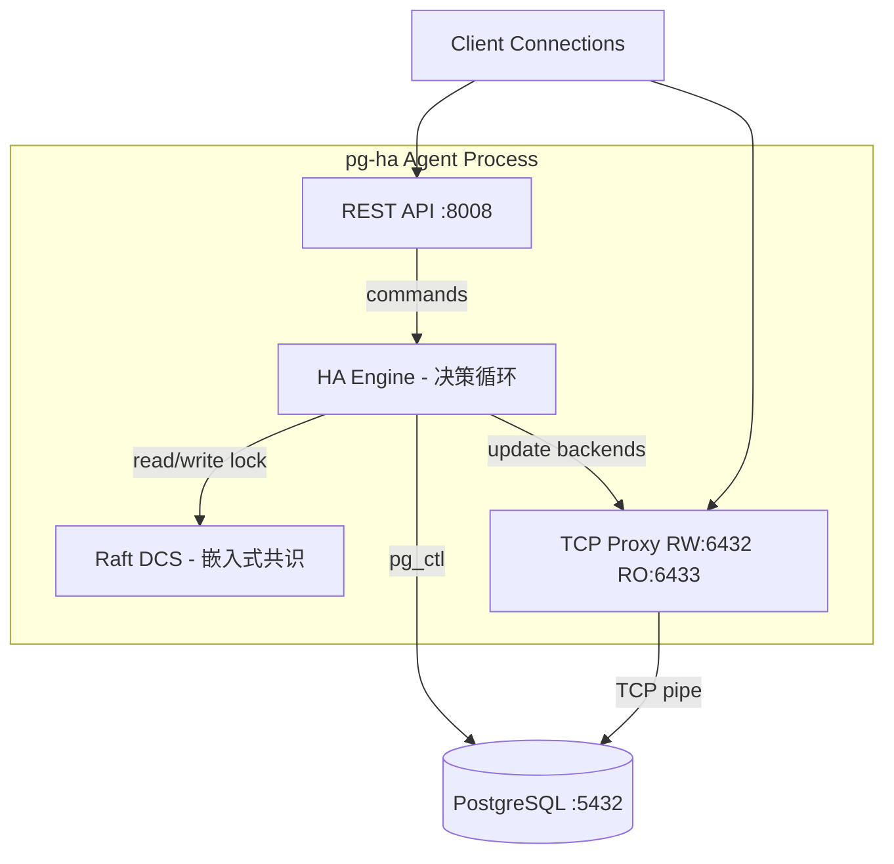
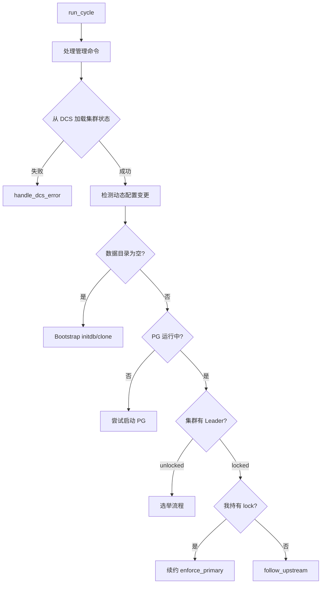
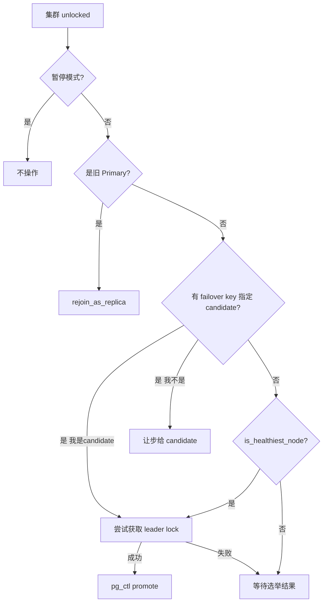
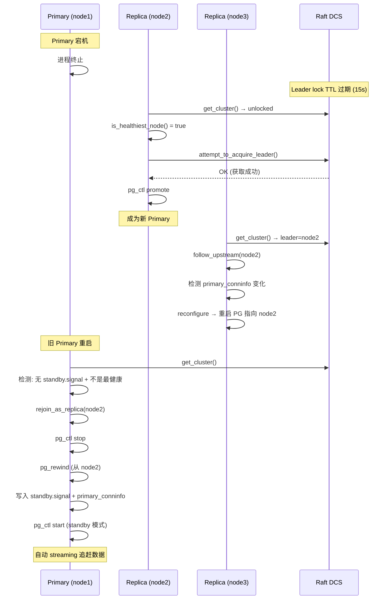
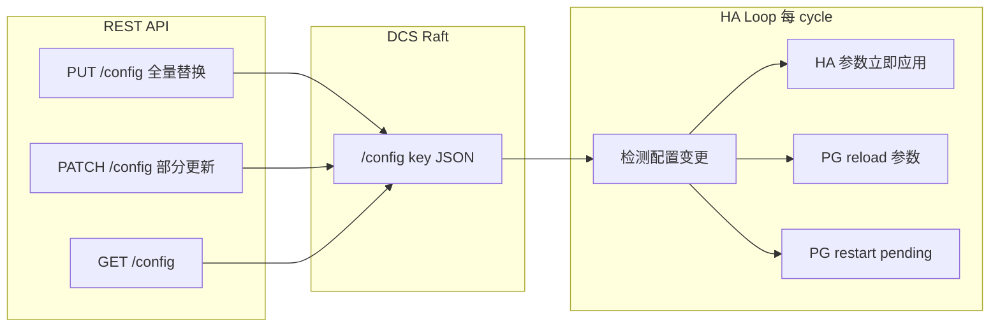
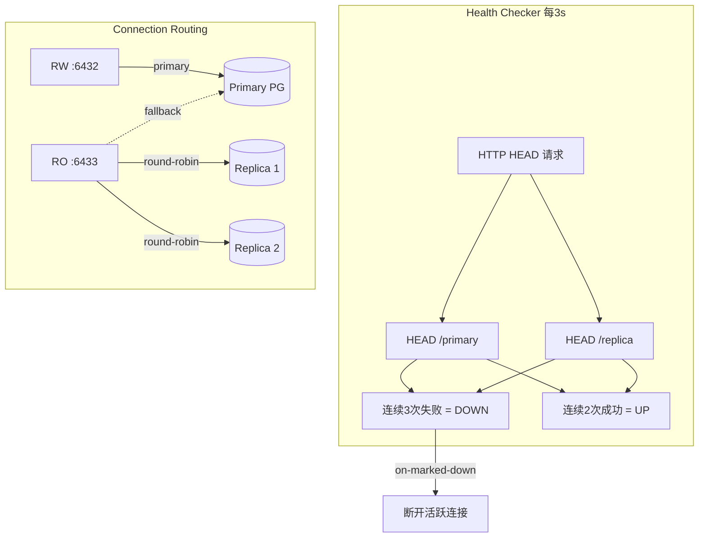
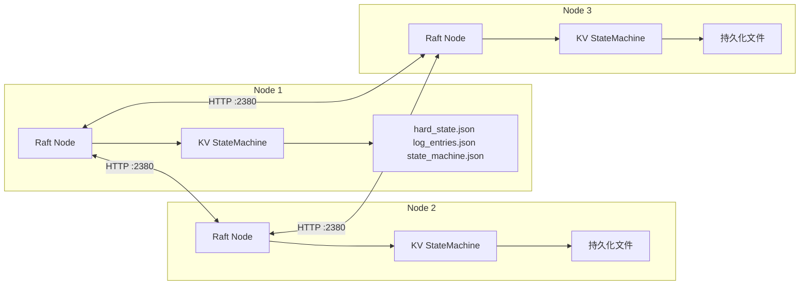

# pg-ha 系统架构图

## 整体架构



## HA 决策循环 (run_cycle)



## 选举流程 (process_unhealthy_cluster)



## Failover + Rejoin 完整流程



## 动态配置流程



## TCP Proxy 健康检查



## Raft 共识层



## DCS KV 存储结构

```
/service/{scope}/
├── leader          → "node1"              (TTL=15s, CAS 原子操作)
├── members/
│   ├── node1       → {conn_url, api_url, state, role}  (TTL)
│   ├── node2       → {conn_url, api_url, state, role}  (TTL)
│   └── node3       → {conn_url, api_url, state, role}  (TTL)
├── initialize      → "system_id"          (原子创建, 初始化竞争)
├── config          → {loop_wait, ttl, postgresql: {parameters: {...}}}
├── failover        → {leader, candidate}  (switchover 请求)
├── sync            → {leader, sync_standby}
├── failsafe        → {node1: api_url, ...}
└── history         → [{timestamp, event_type, old_leader, new_leader}]
```

## 模块依赖关系

```
pg-ha (binary)
├── pg-ha-core      HA 引擎 + PG 生命周期 + 配置 + 类型
│   ├── ha.rs           决策循环 (run_cycle)
│   ├── postgresql.rs   pg_ctl start/stop/promote/rewind/reload
│   ├── bootstrap.rs    initdb / clone / custom bootstrap
│   ├── dynamic_config.rs  GlobalConfig + 变更检测 + patch
│   ├── failsafe.rs     DCS 故障时的安全模式
│   ├── slots.rs        复制槽管理
│   ├── sync.rs         同步复制管理
│   ├── cascading.rs    级联复制
│   ├── standby_cluster.rs  备库集群
│   ├── watchdog.rs     硬件看门狗
│   ├── callbacks.rs    事件回调
│   └── history.rs      集群历史
├── pg-ha-dcs       Raft 共识 + KV 状态机
│   ├── raft_dcs.rs     DcsAdapter 实现
│   ├── store.rs        Raft 存储 (持久化)
│   ├── state_machine.rs KV + TTL + CAS
│   └── raft_server.rs  HTTP RPC
├── pg-ha-api       REST API (axum)
│   ├── routes.rs       健康检查 + 管理端点 + /metrics
│   └── state.rs        共享状态 (AppState)
├── pg-ha-proxy     TCP 负载均衡
│   └── proxy.rs        RW/RO 路由 + 主动健康检查
└── pg-ha-ctl       CLI 工具 (clap + reqwest)
```
