# pg-ha 系统架构图

## 整体架构

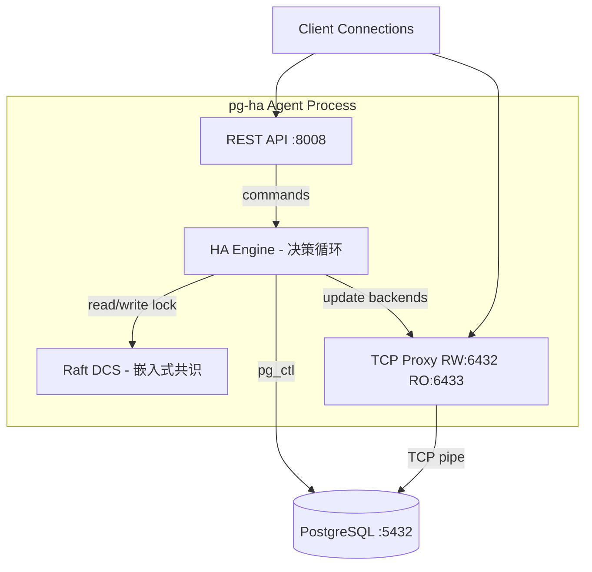

## HA 决策循环 (run_cycle)

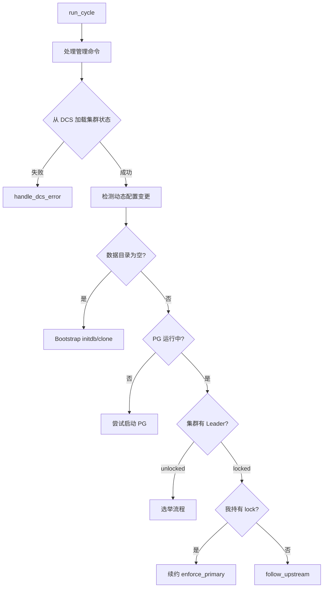

## 选举流程 (process_unhealthy_cluster)

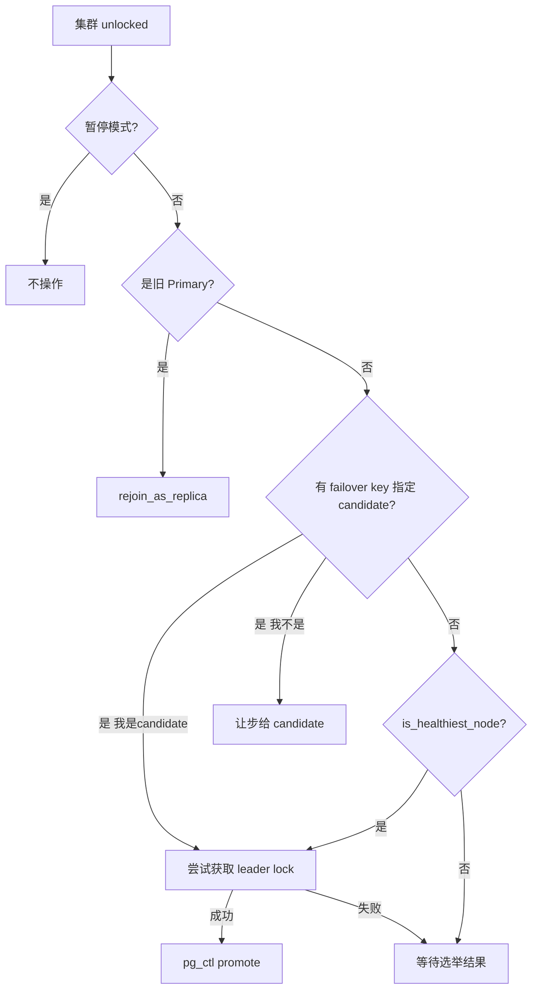

## Failover + Rejoin 完整流程

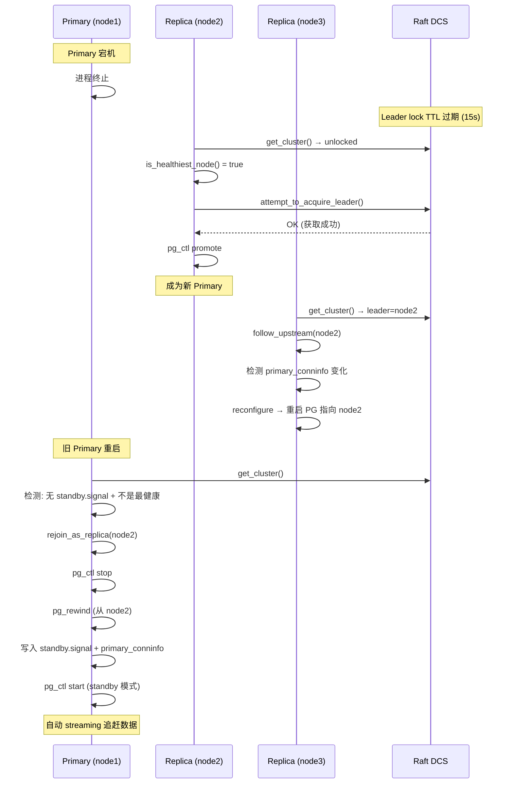

## 动态配置流程

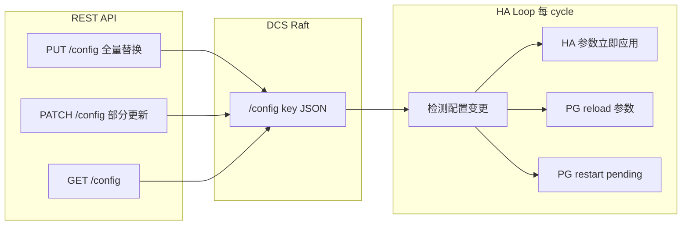

## TCP Proxy 健康检查

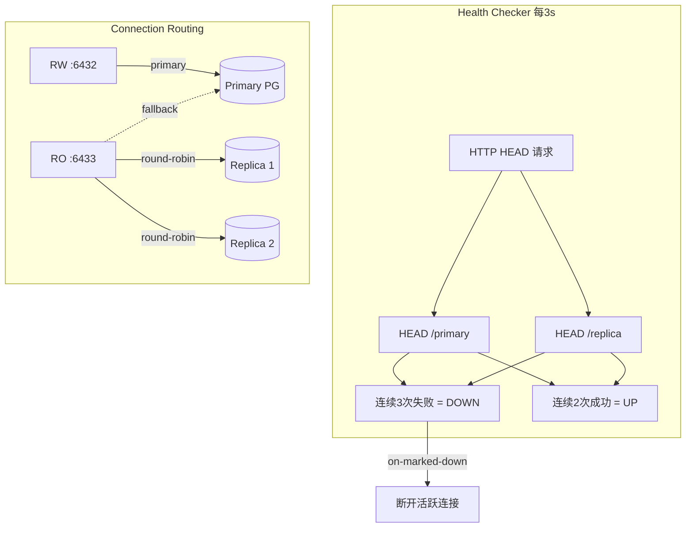

## Raft 共识层

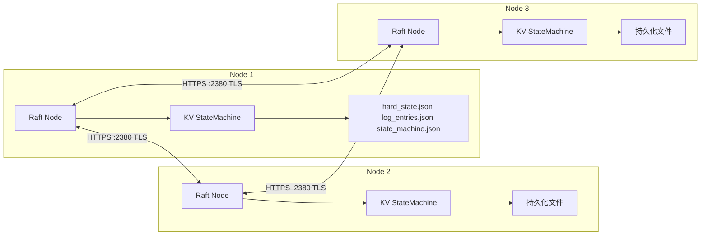

## DCS KV 存储结构

```
/service/{scope}/
├── leader          → "node1"              (TTL=15s, CAS 原子操作)
├── members/
│   ├── node1       → {conn_url, api_url, state, role}  (TTL)
│   ├── node2       → {conn_url, api_url, state, role}  (TTL)
│   └── node3       → {conn_url, api_url, state, role}  (TTL)
├── initialize      → "system_id"          (原子创建, 初始化竞争)
├── config          → {loop_wait, ttl, synchronous_mode, postgresql: {...}}
├── failover        → {leader, candidate}  (switchover 请求)
├── sync            → {leader, sync_standby, quorum}
├── failsafe        → {node1: api_url, ...}
└── history         → [{timestamp, event_type, old_leader, new_leader}]
```

## 同步复制数据流

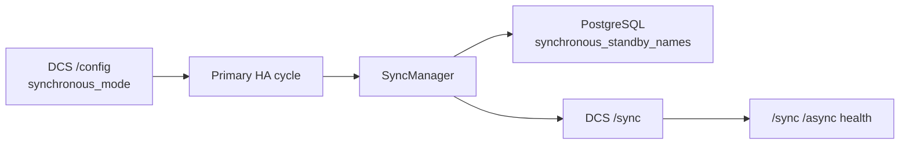

Primary 在持有 Leader Lock 时读取动态配置：

- `synchronous_mode=false`（默认）：清空 `synchronous_standby_names`，写空 `/sync`
- `synchronous_mode=true`：按 `sync_priority` / `nosync` 选出同步备库，设置 `FIRST N (...)`，并写入 `/sync`

目标值未变化时跳过重复 `ALTER SYSTEM` + reload。`/sync`、`/async` 健康检查读取 `/sync.sync_standby` 判断节点角色。

当前范围：同步复制配置与状态发布已实现；故障切换时强制优先同步备库 / quorum 约束尚未实现。

## 模块依赖关系

```
pg-ha (binary)
├── pg-ha-core      HA 引擎 + PG 生命周期 + 配置 + 类型
│   ├── ha.rs           决策循环 (run_cycle)
│   ├── postgresql.rs   pg_ctl start/stop/promote/rewind/reload
│   ├── bootstrap.rs    initdb / clone / custom bootstrap
│   ├── dynamic_config.rs  GlobalConfig + 变更检测 + patch
│   ├── failsafe.rs     DCS 故障时的安全模式
│   ├── slots.rs        复制槽管理
│   ├── sync.rs         同步复制管理
│   ├── cascading.rs    级联复制
│   ├── standby_cluster.rs  备库集群
│   ├── watchdog.rs     硬件看门狗
│   ├── callbacks.rs    事件回调
│   └── history.rs      集群历史
├── pg-ha-dcs       Raft 共识 + KV 状态机
│   ├── raft_dcs.rs     DcsAdapter 实现
│   ├── store.rs        Raft 存储 (持久化)
│   ├── state_machine.rs KV + TTL + CAS
│   └── raft_server.rs  HTTP RPC
├── pg-ha-api       REST API (axum)
│   ├── routes.rs       健康检查 + 管理端点 + /metrics
│   └── state.rs        共享状态 (AppState)
├── pg-ha-proxy     TCP 负载均衡
│   └── proxy.rs        RW/RO 路由 + 主动健康检查
└── pg-ha-ctl       CLI 工具 (clap + reqwest)
```


## TLS 加密通信

Raft RPC 层使用 TLS 加密所有节点间通信，防止集群共识数据在网络上被窃取或篡改。REST API 端口保持 HTTP，仅在内部网络暴露。

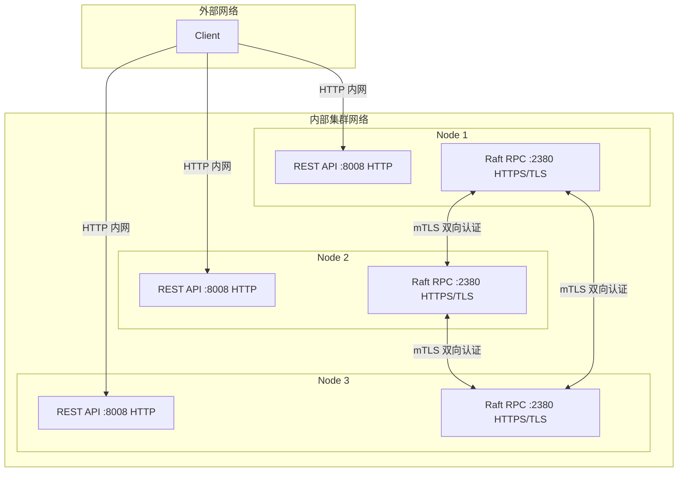

**TLS 配置要点：**

| 组件 | 端口 | 协议 | 说明 |
|------|------|------|------|
| Raft RPC | 2380 | HTTPS (TLS 1.2+) | 节点间共识通信，支持 mTLS |
| REST API | 8008 | HTTP | 内网管理端点，依赖网络隔离 |
| PostgreSQL | 5432 | TCP | PG 原生协议，可独立配置 `ssl` |
| Proxy RW/RO | 6432/6433 | TCP | 透传 PG 连接 |

- Raft RPC 启用 TLS 后，所有 `AppendEntries`、`RequestVote`、`InstallSnapshot` RPC 均通过加密通道传输
- mTLS（双向 TLS）可选启用：每个节点同时验证对端证书，防止未授权节点加入集群
- REST API 保持 HTTP 是因为它仅在内部网络暴露，由 Basic Auth 保护管理端点

## 认证与安全

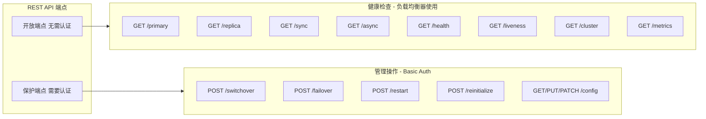

**认证机制：**

- **Basic Auth**：配置 `restapi.username` 和 `restapi.password` 后自动启用
- 认证未配置时，所有端点开放（适用于完全隔离的内网环境）
- 健康检查端点始终开放，供负载均衡器和 TCP Proxy 健康探测使用
- 管理端点（switchover、failover、config 变更等）受 Basic Auth 保护

```yaml
# 配置示例
restapi:
  listen: 0.0.0.0
  port: 8008
  username: admin      # 设置后启用 Basic Auth
  password: s3cr3t     # 管理端点需要此凭证
```

**请求示例：**

```bash
# 健康检查（无需认证）
curl http://localhost:8008/health
curl http://localhost:8008/primary
curl http://localhost:8008/replica

# 管理操作（需要 Basic Auth）
curl -u admin:s3cr3t -X POST http://localhost:8008/switchover \
  -H 'Content-Type: application/json' \
  -d '{"leader": "node1", "candidate": "node2"}'

# 未认证会返回 401
curl -X POST http://localhost:8008/failover
# → {"error": "Unauthorized"}
```

## 优雅关停流程

pg-ha 收到 `SIGTERM` 或 `SIGINT` 信号后，执行分阶段优雅关停，确保数据安全和快速故障转移。

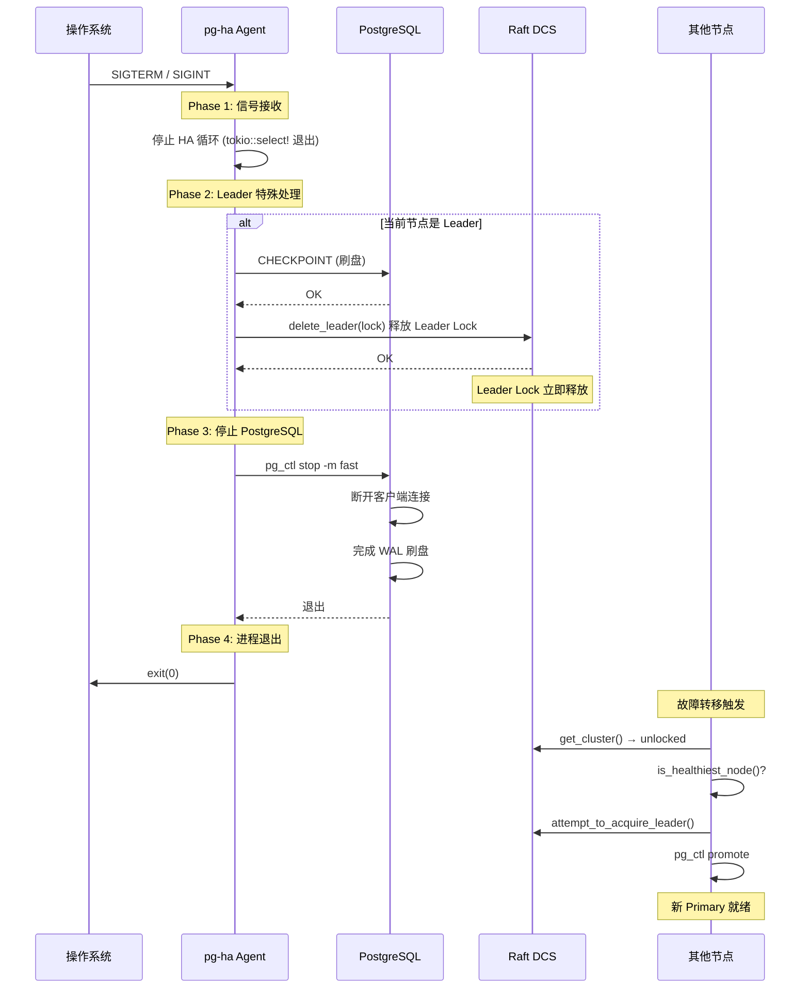

**关键设计决策：**

1. **Leader 主动释放锁**：不等待 TTL 过期，立即释放 Leader Lock，使其他节点能在秒级内完成故障转移
2. **CHECKPOINT 在释放锁之前**：确保所有已提交事务的 WAL 已刷盘，避免数据丢失
3. **fast 模式停止 PG**：立即断开客户端连接，但允许正在进行的 WAL 写入完成
4. **信号处理的 tokio::select!**：与 HA 循环、API 服务器、Proxy 并行监听，任一退出触发关停

**时间线：**

| 阶段 | 耗时 | 说明 |
|------|------|------|
| Phase 1 | < 1ms | 信号接收，select! 退出 |
| Phase 2 | 1-5s | CHECKPOINT + 释放锁 |
| Phase 3 | 1-3s | pg_ctl stop fast |
| Phase 4 | 即时 | exit(0) |
| 故障转移 | 1-2s | 其他节点检测到 unlocked 并 promote |
| **总计** | **3-10s** | 从信号到新 Primary 就绪 |

## 日志系统

pg-ha 使用 `tracing` + `tracing-subscriber` 提供 text/json 双模式日志输出。

**日志模式切换：**

| 环境变量 | 值 | 效果 |
|---------|---|------|
| `PG_HA_LOG_FORMAT` | `text`（默认） | 人类可读的彩色日志 |
| `PG_HA_LOG_FORMAT` | `json` | 结构化 JSON 日志（生产推荐） |
| `RUST_LOG` | tracing 过滤表达式 | 控制日志级别和模块过滤 |

**Text 模式示例（默认）：**

```
2024-01-15T10:30:00.123Z  INFO pg_ha: Starting pg-ha agent name="node1" scope="prod-cluster"
2024-01-15T10:30:02.456Z  INFO pg_ha_dcs: Raft cluster bootstrapped with 3 members
2024-01-15T10:30:05.789Z  INFO pg_ha_core::ha: run_cycle completed role=Primary leader=true
```

**JSON 模式示例（`PG_HA_LOG_FORMAT=json`）：**

```json
{"timestamp":"2024-01-15T10:30:00.123Z","level":"INFO","target":"pg_ha","message":"Starting pg-ha agent","name":"node1","scope":"prod-cluster"}
{"timestamp":"2024-01-15T10:30:02.456Z","level":"INFO","target":"pg_ha_dcs","message":"Raft cluster bootstrapped with 3 members"}
{"timestamp":"2024-01-15T10:30:05.789Z","level":"INFO","target":"pg_ha_core::ha","message":"run_cycle completed","role":"Primary","leader":true}
```

**RUST_LOG 环境变量控制：**

```bash
# 默认级别（内置）
RUST_LOG="pg_ha=info,openraft::replication=off"

# 调试 HA 决策循环
RUST_LOG="pg_ha_core::ha=debug,pg_ha=info"

# 调试 Raft 共识
RUST_LOG="pg_ha_dcs=debug,openraft=debug,pg_ha=info"

# 调试网络通信
RUST_LOG="pg_ha_dcs::network=trace,pg_ha=info"

# 全部 trace（大量输出，仅调试用）
RUST_LOG="trace"
```

**日志格式优先级：**

1. 环境变量 `PG_HA_LOG_FORMAT` 覆盖默认值
2. `RUST_LOG` 环境变量覆盖内置的过滤表达式
3. 内置默认：`pg_ha=info` + `openraft::replication=off`（抑制高频复制日志）
